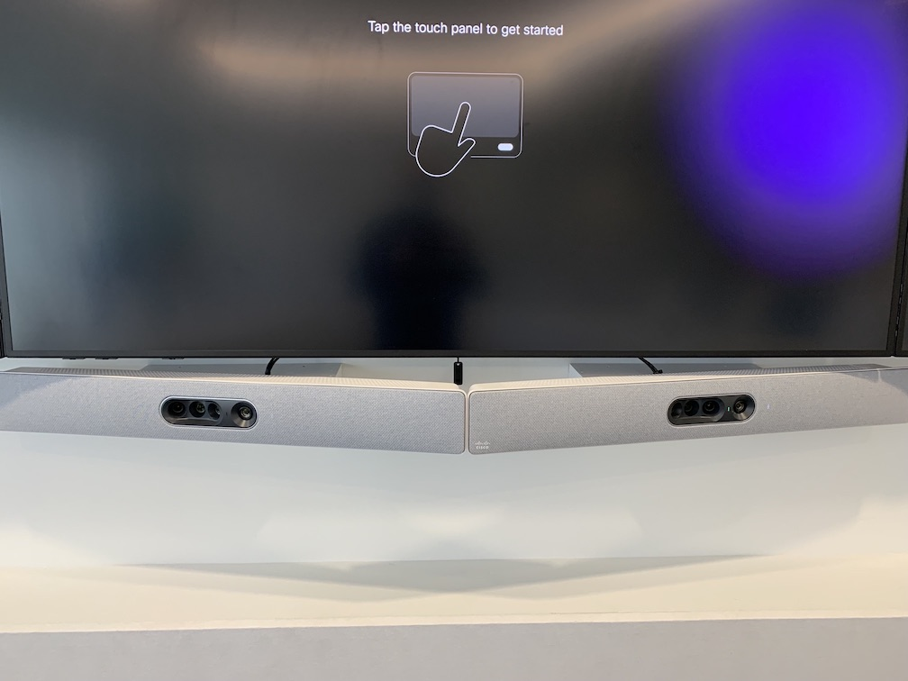
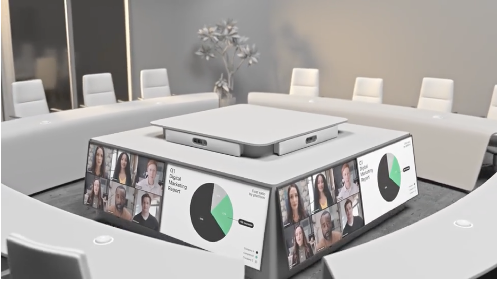
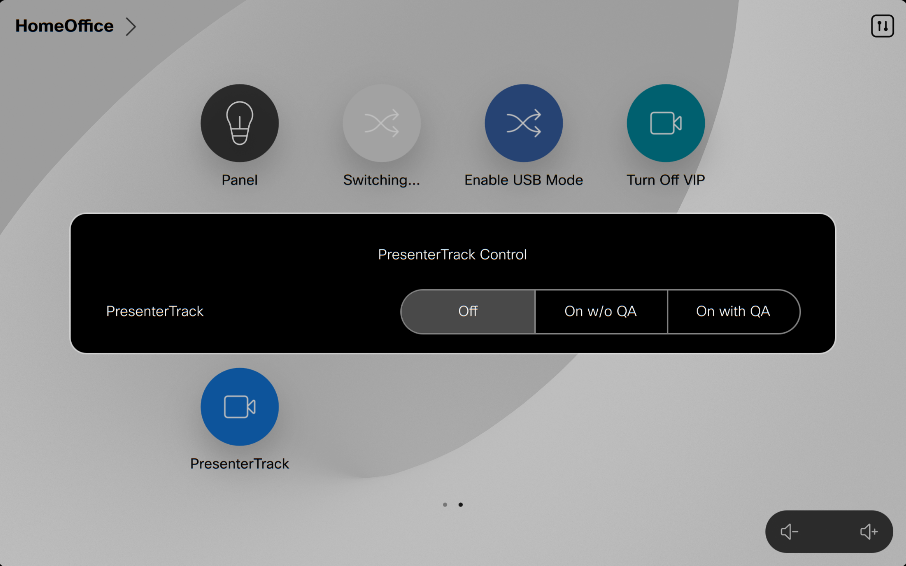

# GVE DevNet Webex Devices Executive Room Multi Aux Switching Macro

Webex Room Device macro to switch input source to camera pointed in the direction of the area of the room that has audio activity as detected by the table microphones in the zone.

| RoomOs Minimum Version | Webex Cloud | Webex Edge (Hybrid Cloud) | On-Premise | Microsoft Teams Room On Cisco Devices |
| ---------------------- | ----------- | ------------------------- | ---------- | ------------------------------------- |
| 10.17.1.0              | Yes         | Yes                       | Yes        | No - API Limitation                   |

Check the [Change Log](CHANGELOG.md) in this repository for the most recent changes and fixes to this macro.

## Contacts

- Gerardo Chaves (gchaves@cisco.com)

## Solution Components

- Webex Collaboration Endpoints
- Javascript
- xAPI

## Requirements

- Devices must be running RoomOS 10.8 or later
- If running RoomOS 11, must be 11.0.0.4 or later for base functionality but for side-by-side mode you need at least version 11.2.1

## Installation/Configuration

This sample includes 2 macros that can be installed on separate Webex Codecs to work in conjunction to cover a large executive
room with multiple QuadCam cameras and other camera combinations given the limitation that only 1 QuadCam can be connected to a codec.

  
Example of a Quad Camera Cluster pointing a different areas of a large room.

In that scenario, the first QuadCam is connected to the main
codec (typically a Webex Codec Pro) and the second one to the auxiliary codec (typically a Webex Codec Plus) which in turn has it's HDMI 1
video output connected to the main codec into it's HDMI 2 input.

Other layouts can be supported with this macro, including "Campfire" configurations:



In that scenario, one of the QuadCams in the center "island" is conected to the Main CodecPro whereas the others are connected to auxiliary Codecs that in turn are connected each to one of the other QuadCams to manage it and send the video feed from it to the Main CodecPro.

If you only have one Webex Codec and will not be trying to use 2 QuadCams, you can just use one of the macros ('main_codec.js') on
that codec to control any allowed combination 4K PTZ cameras, a Cisco SpeakerTrack 60 camera array or a QuadCam camera.

NOTE: The new "Top N speakers" feature is configured by editing the `auto_top_speakers` constant and settings the `enabled` atrribute to `true`. You then edit the `default_connectors` array to provide an
ordered list of the connectors to use when showing the top N speakers and also the layout to use in the `layout` attribute. The `max_speakers` corresponds to the N value of the Top N speakers feature, so it allows you
to limit the number of top speakers to show. This feature does not yet work with compositions that include PTZ Zones.

This sample also includes the GMM_Lib macro that is needed for compatibility with the USB Mode V3 Beta macro and improved inter-codec communication. Version 3.0.6 of that macro is also included but if you have a newer version you can use that one instead.  
NOTE: You cannot change the name of the USB Mode v3 macro or else the code in `main_codec_macro.js` will not be able to communicate with it. The name of that macro as stored in your codec must start with "USB_Mode_Version_3" but can have other characters after that.

NOTE: Even if you do not plan on installing and using the USB Mode V3 macro, you do need to install the GMM_Lib macro on the main and aux codecs. To
do so, just create a new macro called "GMM_Lib" and copy the contents of the GMM_Lib.js file in this repository to it. Save it but do not turn
it on; it is just a library that main_codec_macro and aux_codec_macro loads.

You can find technical drawings and connection diagrams for the most common scenarios supported by this macro here:
[Multi_Aux_Boardroom_System_Drawing_REV_1.pdf](Multi_Aux_Boardroom_System_Drawing_REV_1.pdf)

Notice that for the dual codec scenario, the camera input 2 on the Primary (Main) Codec comes from
Output 1 on the Auxiliary codec since we are just using that codec to pass along the video from the QuadCam.
Also notice that all microphones are connected to the Primary (Main) Codec since the macro running
there is the one making all of the decisions on which camara to activate depending on audio activity.
Only analog microphones connected to input connectors 1-8 are supported.

WARNING: Make sure the Main an Auxiliary codecs are NOT in the same Workspace in Control Hub. If they are, the Auxiliary codecs will try to join the same call as the Main codec and that will interfere with the overall functionality of this macro.

After the codecs, cameras and microphones are correctly connected do the following:

1. Edit your local version of files 'main_codec.js' and 'aux_codec.js' according to these instructions to configure the macros:  
   [MainMacroInstructions.pdf](MainMacroInstructions.pdf) .

NOTE: Image composing is not supported yet in WebRTC mode so even if you create a composition with multiple input sources, it will only show the first connector of the overview composition while in a WebRTC call but will revert to side by side views if so configured for regular SIP and webex calls.

2. Load the modified contents of 'main_codec.js' as a new macro into the Macro editor of the main codec and the contents of the modified 'aux_codec.js'
   into a new macro into the Macro editor of the auxiliary codec if applicable.
   'main_codec.js' contains all of the logic to choose which input to select
   as well as the logic to make sure that the Aux codec is active and receiving the input from QuadCam2.
   If you are unfamiliar with Cisco Room device macros and how to manage them, this is a good article to get started:
   https://help.webex.com/en-us/np8b6m6/Use-of-Macros-with-Room-and-Desk-Devices-and-Webex-Boards

3. Enable or "turn on" the newly created macro on the primary codec and the auxiliary codec if applicable.

NOTE: The macro is written to hide the mid-call controls “Lock meeting” and “Record”. The reason for this is so that the
custom “Camera Control” button added above can be seen always in a call without having to press on the More.. button.
If you prefer to have the mid-call controls always showing edit line 116 of the 'main_codec.js' on the main codec that has the following config command:

```
xapi.Config.UserInterface.Features.Call.MidCallControls.set("Hidden")
```

and change the value in the string being sent as a parameter from “Hidden” to “Auto”

## Usage

Once the macros are loaded and activated, the correct video switching behavior should occur automatically every time a call connects.

To manually turn on and off the Automatic switching based on microphone input across the two quad cams, you can use the "Camera Control"
custom panel that the macro auto-generates; just press the Camera Control button on the Touch 10 or Navigator:


That should bring up the following Panel where you can select the behavior desired:


If you have correctly configured an "overview" composition, you can control when that view is shown from the custom camera control panel by toggling the "Side by side" switch between Overview (when there is no voice activity detected in the room or the microphones are muted) and "Always". If set to "Always", a side by side composition will be send to the far end that includes the camera associated to the microphones that are detecting audio activity with SpeakerTrack turned and a the other camera will be showing the overview camera preset.

You can use the "Force Frames" toggle switch to temporarily set the main codec and all Aux codecs to 'Frames' instead of the other variants of SpeakerTrack. When you turn off the toggle, it will go back to whatever you configured in the macro using the ST_DEFAULT_BEHAVIOR constant.

During a call, you can use the PresenterTrack custom panel button to turn on PresenterTrack with our without the Q&A mode option:



When in Presenter Track mode with Q&A mode enabled, the macro will take care of keeping the focus on the presenter and if a question comes in from the audience it will compose the image of the presenter plus the audience member while they are talking and a few seconds afterwards (controlled by the PRESENTER_QA_KEEP_COMPOSITION_TIME configurable constant in the macro) it will focus back only on the presenter; this behavior is similar to the native "Classroom Mode" which is not compatible with this macro. If you select PresenterTrack without the Q&A mode option, the macro will make sure the presenter is always the one being shown in the call irrespective if anyone else in the room is speaking until you turn off PresenterTrack either via the custom panel or using the native camera controls of the codec.

The following actions with turn off the automatic behaviour for you in addition to manually turning it off:

a) When a call disconnects  
b) Bringing the main codec out of half-wake mode

### LICENSE

Provided under Cisco Sample Code License, for details see [LICENSE](LICENSE.md)

### CODE_OF_CONDUCT

Our code of conduct is available [here](CODE_OF_CONDUCT.md)

### CONTRIBUTING

See our contributing guidelines [here](CONTRIBUTING.md)

#### DISCLAIMER:

<b>Please note:</b> This script is meant for demo purposes only. All tools/ scripts in this repo are released for use "AS IS" without any warranties of any kind, including, but not limited to their installation, use, or performance. Any use of these scripts and tools is at your own risk. There is no guarantee that they have been through thorough testing in a comparable environment and we are not responsible for any damage or data loss incurred with their use.
You are responsible for reviewing and testing any scripts you run thoroughly before use in any non-testing environment.
